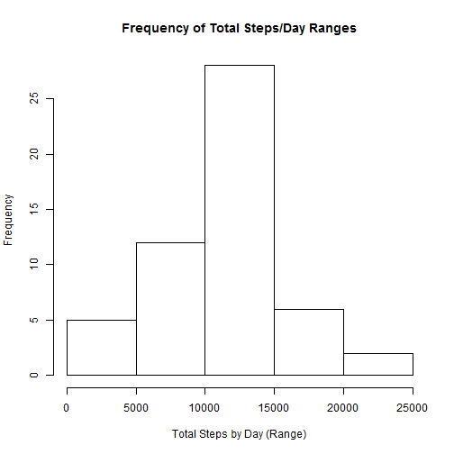
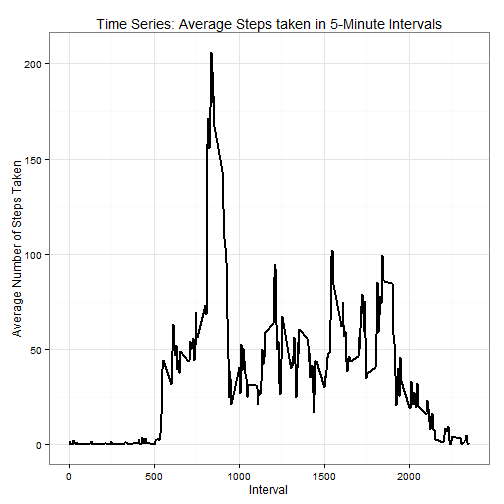
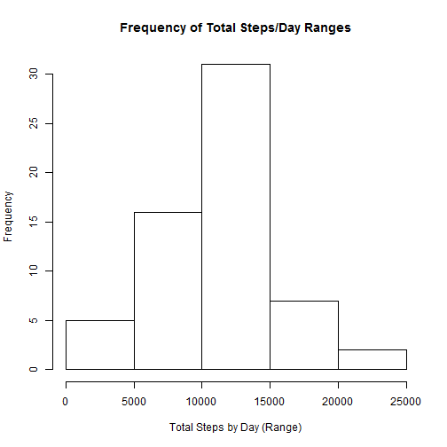
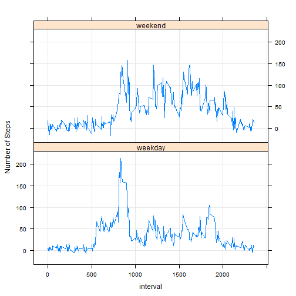

## Loading and preprocessing the data

```r
unzip("./activity.zip", exdir=".")
activity <- read.csv("./activity.csv")
library(lubridate)
activity$date <- ymd(as.character(activity$date))
```

## What is the mean total number of steps taken per day?
As instructed, I am ignoring the missing values (NA) in this section.

Here is a histogram showing the total number of steps taken per day

```r
stepsbyday <- aggregate(steps ~ date, data = activity, FUN = sum)
hist(stepsbyday$steps, xlab ="Total Steps by Day (Range)", main = "Frequency of Total Steps/Day Ranges")
```

 

The mean and median for the total number of steps taken per day are:

```r
mean(stepsbyday$steps)
```

```
## [1] 10766
```

```r
median(stepsbyday$steps)
```

```
## [1] 10765
```


## What is the average daily activity pattern?

First compute the average number of steps taken across all days by 5-minute intervals.
Then make a time-series plot (I used ggplot) to show the average number of steps taken for each 5-minute interval.


```r
stepsbyinterval <- aggregate(steps ~ interval, data = activity, FUN = mean)
library(ggplot2)
g <- ggplot(stepsbyinterval, aes(x=interval, y=steps))
g + theme_bw() + geom_line(size=1) + xlab("Interval") + ylab("Average Number of Steps Taken") + ggtitle("Time Series: Average Steps taken in 5-Minute Intervals") 
```

 


The following 5-minute interval has the highest average number of steps across all days:

```r
maxinterval <- stepsbyinterval[which.max(stepsbyinterval$steps),]
maxinterval$interval
```

```
## [1] 835
```


## Imputing missing values

Running a summary in the data set shows the number of missing values (NA) for each variable: Only **steps** contains missing values, and this variable has 2304 missing values 


```r
summary(activity)
```

```
##      steps            date               interval   
##  Min.   :  0.0   Min.   :2012-10-01   Min.   :   0  
##  1st Qu.:  0.0   1st Qu.:2012-10-16   1st Qu.: 589  
##  Median :  0.0   Median :2012-10-31   Median :1178  
##  Mean   : 37.4   Mean   :2012-10-31   Mean   :1178  
##  3rd Qu.: 12.0   3rd Qu.:2012-11-15   3rd Qu.:1766  
##  Max.   :806.0   Max.   :2012-11-30   Max.   :2355  
##  NA's   :2304
```

```r
sum(is.na(activity$steps))
```

```
## [1] 2304
```

As a fill-in strategy, I am using **VIM's irmi** (Iterative Robust Model-based Imputation) to impute missing values.
Please refer to the following article on identifying and imputing missing data for more information:
http://www.unt.edu/rss/class/Jon/Benchmarks/MissingValueImputation_JDS_Nov2010.pdf


```r
if (!"VIM" %in% installed.packages()) {install.packages("VIM")}
library(VIM)
imputed_activity <- irmi(activity)
```

```
## Time difference of -18.55 secs
## Imputation performed on the following data set:
##          type      #missing
## steps    "integer" "2304"  
## date     "POSIXct" "0"     
## interval "integer" "0"
```

With **imputed_activity** as the newly imputed dataset, we can now compare the histogram, means and mediums from the imputed data set with that from the non-imputed datat set (see above).


```r
imp_stepsbyday <- aggregate(steps ~ date, data = imputed_activity, FUN = sum)
hist(imp_stepsbyday$steps, xlab ="Total Steps by Day (Range)", main = "Frequency of Total Steps/Day Ranges")
```

 

```r
mean(imp_stepsbyday$steps)
```

```
## [1] 10774
```

```r
median(imp_stepsbyday$steps)
```

```
## [1] 10600
```

Compared with the non-imputed data, the shape of the histograms and the range of the total number of steps taken per day remain the same but the frequency of the total steps are now higher - because the missing values have been assigned an imputed value. Mean and median remain almost the same: from 10766 and 10765 to 10761 and 10765, respectively.


## Are there differences in activity patterns between weekdays and weekends?

First, a new column is added to the imputed data set **activity_imp** - the value in the column is either *weekday* or *weekend* depending on the day of the week of the date in each observation (row). This new column will be of class *factor*.

```r
activity_imp <- data.table(imputed_activity)
checkweekday <- function(x) {
        if(weekdays(x) == "Saturday" | weekdays(x) == "Sunday") y <- "weekend"
        else y <- "weekday"
        return(y)
}
activity_imp$weekday <- sapply(activity_imp$date,checkweekday)
activity_imp$weekday <- as.factor(activity_imp$weekday)
```

Then the average number of steps taken across all days by 5-minute intervals is computed using *weekday** as a factor.

```r
stepsbyinterval_imp <- aggregate(steps ~ interval+weekday, data = activity_imp, FUN = mean)
```

Using the lattice package, a panel plot comparing the time series plots of 5-minute intervals and average steps taken across all weekend versus weekday days is created.


```r
library(lattice)
xyplot(steps ~ interval | weekday, stepsbyinterval_imp, type = "l", grid = TRUE, layout = c(1,2),  ylab="Number of Steps")
```

 

Reviewing the weekday and weekend plots, it appears that the average number of steps taken are generally higher throughout the day on the weekends. The higher average is also maintained longer through the 5-minute intervals (suggesting that the subjects are active longer) although the average steps rises slower during the weekends compared to the weekdays.

Not surprisingly, the highest average number of steps (the peak) is in the morning during the weekdays, and commuting to and from work is  clearly visible during the weekdays with a smaller spike during both standard rush hours.
